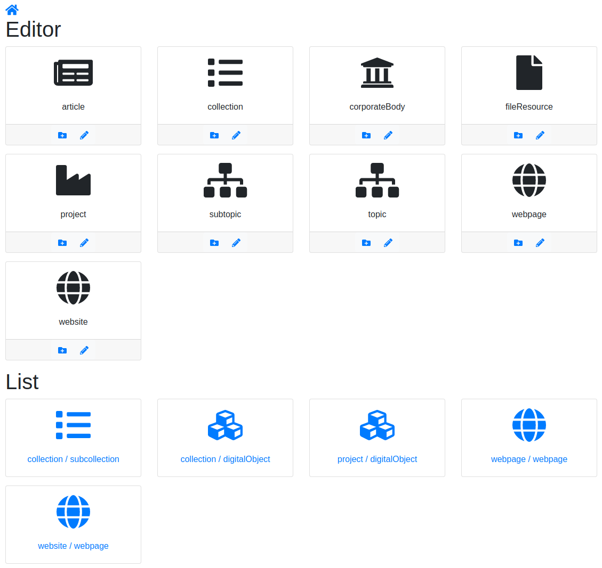

# `cudami` editor component

## Local development without java backend

see [official documentation](https://webpack.js.org/configuration/dev-server/)

1. install dependencies: `npm install`
2. start webpack development server: `npm start`
3. open <http://localhost:3000> to browse to the development UI implemented in `src/App.jsx`:



Starting from this development-only startpage all subsequent pages are productive code.

*Recommended for inspecting state and props:* React developer tools for [Chrome](https://chrome.google.com/webstore/detail/react-developer-tools/fmkadmapgofadopljbjfkapdkoienihi) and [Firefox](https://addons.mozilla.org/en-US/firefox/addon/react-devtools/)

After changing code in editor component, compile the whole application:

```
$ cd ..
$ mvn clean install -U
```

Start application (repository server and management webapp) and test your changes.

## Format JavaScript Files

```
npm install && npm run format
```

## Lint JavaScript files

```
npm install && npm run lint
```

## Developer guide for adding a new object type

### List for an Identifiable (Table)

Example: persons list

* Add navigation icon with link to list page

In `cudami/dc-cudami-admin/src/main/resources/templates/main.html`:

```html
<div class="card">
  <a class="btn" th:href="@{/persons}" th:title="#{persons}">
    <div class="card-body">
      <div class="icon"><i class="fas fa-users"></i></div>
    </div>
    <div class="card-footer"th:text="#{persons}">Persons</div>
  </a>
</div>
```

* Add controller endpoint for providing thymeleaf template

In `cudami/dc-cudami-admin/src/main/java/de/digitalcollections/cudami/admin/controller/identifiable/entity/agent/PersonsController.java`:

```java
@GetMapping("/persons")
  public String list(Model model) throws HttpException {
    final Locale displayLocale = LocaleContextHolder.getLocale();
    model.addAttribute(
        "existingLanguages",
        languageSortingHelper.sortLanguages(displayLocale, service.getLanguages()));
    return "persons/list";
  }
```

As the list should be multilingual, we need the list of all languages the label of persons have in backend. Therefore the call `service.getLanguages()` has to be implemented if not exists already.

* Add `getLanguages` method

In `cudami/dc-cudami-client/src/main/java/de/digitalcollections/cudami/client/identifiable/entity/agent/CudamiPersonsClient.java`:

```
public List<Locale> getLanguages() throws HttpException {
    return doGetRequestForObjectList("/latest/persons/languages", Locale.class);
}
```

In `cudami/dc-cudami-server/dc-cudami-server-webapp/src/main/java/de/digitalcollections/cudami/server/controller/identifiable/entity/agent/PersonController.java`

```
@ApiMethod(description = "Get languages of all persons")
@GetMapping(
    value = {"/latest/persons/languages", "/v3/persons/languages"},
    produces = MediaType.APPLICATION_JSON_VALUE)
@ApiResponseObject
public List<Locale> getLanguages() {
  return personService.getLanguages();
}
```

The method `getlanguages()` is implemented generically in underlying `IdentifiableService` and `IdentifiableRepository`. No further implementation needed.

* Add thymeleaf template embedding react-table

File `cudami/dc-cudami-admin/src/main/resources/templates/persons/list.html`:

```html
...
<section layout:fragment="content">
  <div id="list"></div>
  <script th:src="@{/js/identifiable-list.bundle.js}"></script>
  <script th:inline="javascript">
    IdentifiableList({
      apiContextPath: /*[[@{/}]]*/ '',
      enableSearch: true,
      existingLanguages: /*[[${existingLanguages}]]*/,
      id: "list",
      showEdit: true,
      showNew: true,
      type: "person",
      uiLocale: /*[[${#locale.language}]]*/
    });
  </script>
</section>
...
```

This initializes an `IdentifiableList`-React-Component, defined in `cudami/dc-cudami-editor/src/lib/IdentifiableList.jsx`.

Inside this the render method is called for the React-component `PagedIdentifiableList` defined in `cudami/dc-cudami-editor/src/components/PagedIdentifiableList.jsx`

If you don't need a search field within the result table, just leave out the directive `enableSearch: true` or
set it to `false`.

* Add Identifiable-specific table rendering

In `cudami/dc-cudami-editor/src/components/PagedIdentifiableList.jsx` add handling for specific tdentifiable type:

```
...
import PersonList from './PersonList'
...
  getListComponent = () => {
    const LIST_COMPONENT_MAPPING = {
      collection: CollectionList,
      digitalObject: DigitalObjectList,
      subcollection: CollectionList,
      person: PersonList,
      webpage: WebpageList,
      website: WebsiteList,
    }
...
```

Add table component `cudami/dc-cudami-editor/src/components/PersonList.jsx`:

```
import React, {useContext} from 'react'
import {Table} from 'reactstrap'
import {useTranslation} from 'react-i18next'
import {FaHashtag, FaImage} from 'react-icons/fa'

import AppContext from './AppContext'
import IdentifierList from './IdentifierList'
import ListButtons from './ListButtons'
import PreviewImage from './PreviewImage'
import {formatDate} from './utils'
import {typeToEndpointMapping} from '../api'

const PersonList = ({
  enableMove,
  enableRemove,
  identifiables,
  identifierTypes,
  language,
  onMove,
  onRemove,
  pageNumber,
  pageSize,
  parentType,
  showEdit,
  type,
}) => {
  const {t} = useTranslation()
  const {apiContextPath, uiLocale} = useContext(AppContext)
  const viewBaseUrl = `${apiContextPath}${typeToEndpointMapping[type]}`
  return (
    <Table bordered className="mb-0" hover responsive size="sm" striped>
      <thead>
        <tr>
          <th className="text-right">
            <FaHashtag />
          </th>
          <th className="text-center">
            <FaImage />
          </th>
          <th className="text-center">{t('label')}</th>
          <th className="text-center">{t('identifiers')}</th>
          <th className="text-center">{t('lastModified')}</th>
          <th className="text-center">{t('actions')}</th>
        </tr>
      </thead>
      <tbody>
        {identifiables.map(
          (
            {
              identifiers,
              label,
              lastModified,
              previewImage,
              previewImageRenderingHints,
              uuid,
            },
            index
          ) => (
            <tr key={uuid}>
              <td className="text-right">
                {index + 1 + pageNumber * pageSize}
              </td>
              <td className="text-center">
                <PreviewImage
                  image={previewImage}
                  renderingHints={previewImageRenderingHints}
                  width={30}
                />
              </td>
              <td>
                {label[language] && (
                  <a href={`${viewBaseUrl}/${uuid}`}>{label[language]}</a>
                )}
              </td>
              <td>
                <IdentifierList
                  identifiers={identifiers}
                  identifierTypes={identifierTypes}
                />
              </td>
              <td className="text-center">
                {formatDate(new Date(lastModified), uiLocale)}
              </td>
              <td className="text-center">
                <ListButtons
                  enableMove={enableMove}
                  enableRemove={enableRemove}
                  onMove={() => onMove(index)}
                  onRemove={() => onRemove(index)}
                  parentType={parentType}
                  showEdit={showEdit}
                  viewUrl={`${viewBaseUrl}/${uuid}`}
                />
              </td>
            </tr>
          )
        )}
      </tbody>
    </Table>
  )
}

export default PersonList
```

* Register identifiable type to endpoint mapping

In `cudami/dc-cudami-editor/src/api.js` add endpoint mapping for type `person`:

```
export const typeToEndpointMapping = {
  article: 'articles',
  collection: 'collections',
  corporateBody: 'corporatebodies',
  digitalObject: 'digitalobjects',
  fileResource: 'fileresources',
  geoLocation: 'geolocations',
  identifierType: 'identifiertypes',
  person: 'persons',
  project: 'projects',
  renderingTemplate: 'renderingtemplates',
  subcollection: 'subcollections',
  topic: 'topics',
  webpage: 'webpages',
  website: 'websites',
}
```

* Add Endpoint for table component

In `cudami/dc-cudami-admin/src/main/java/de/digitalcollections/cudami/admin/controller/identifiable/entity/agent/PersonsController.java`:

```
@GetMapping("/api/persons")
@ResponseBody
public SearchPageResponse<Person> findAll(
    @RequestParam(name = "pageNumber", required = false, defaultValue = "0") int pageNumber,
    @RequestParam(name = "pageSize", required = false, defaultValue = "25") int pageSize,
    @RequestParam(name = "searchTerm", required = false) String searchTerm)
    throws HttpException {
  SearchPageRequest searchPageRequest = new SearchPageRequest(searchTerm, pageNumber, pageSize);
  return service.find(searchPageRequest);
}
```

If you don't need to search within the list, you should remove the parameter `searchTerm`,
work with `PageRequest` and  return a `PageResponse` instead.


* Add internationalized texts

In `cudami/dc-cudami-editor/src/locales/de/translation.json`

```
{
  ...
  "translation": {
    ...
    "person": "Person",
    "persons": "Personen",
    ...
    "totalElements": {
      ...
      "persons": "{{ count }} Person gefunden",
      "persons_plural": "{{ count }} Personen gefunden",
      ...
    }
  ...
  }
}
```

In `cudami/dc-cudami-editor/src/locales/en/translation.json`

```
{
  ...
  "translation": {
    ...
    "person": "Person",
    "persons": "Persons",
    ...
    "totalElements": {
      ...
      "persons": "found {{ count }} person",
      "persons_plural": "found {{ count }} persons",
      ...
    }
  ...
  }
}
```