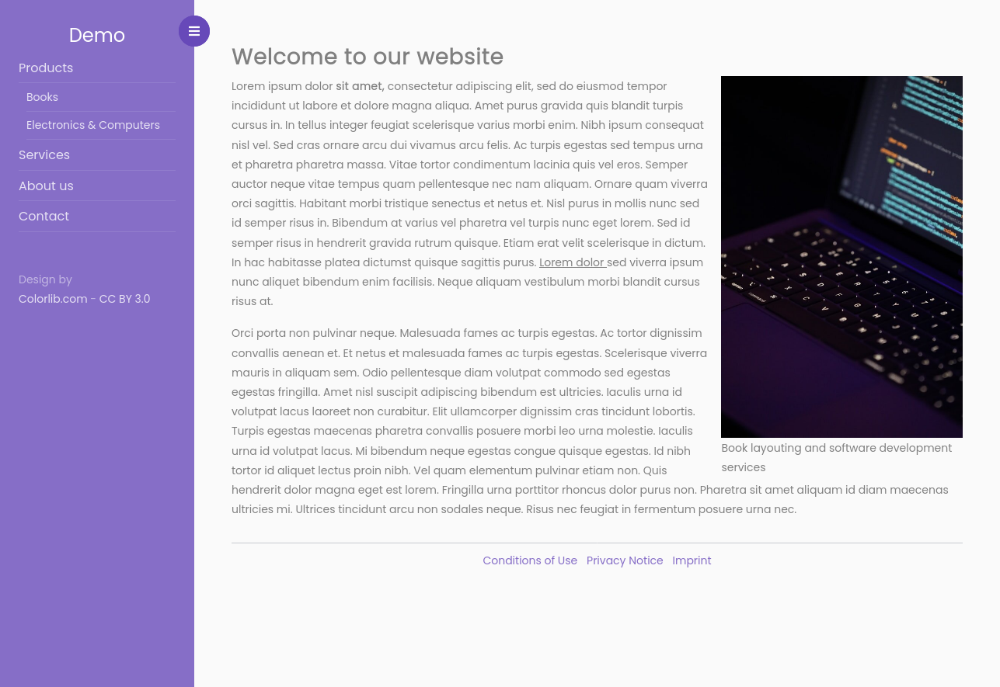

# cudami Website Webapp

This webapp is an out of the box cudami Website "viewer".
It provides the web-frontend (HTML) for a website and its webpages created in cudami.

## Prerequisites

All you need to do before using this webapp is

- create a website (in cudami Management webapp)
- create webpages under this website (in cudami Management webapp)

## Run

### Basic configuration

Copy the UUID of the created website and start this webapp
- giving the UUID of the website and
- the server url of the cudami backend (API) (without trailing slash)
as params like this, e.g.:

```
java -jar cudami-frontend-website-1.0.0-SNAPSHOT.jar \
  --cudami.server.url=http://localhost:9000 \
  --cudami.website=ea9ddc66-e822-4867-9585-a43c6ed8bd98
```

(Note: pass arguments with double dash `--` AFTER `-jar`-argument)

Open your browser and request `http://localhost:8080`.

The website will be rendered with all webpages (down to given level, default = 3) as sidebar navigation.

### Advanced configuration

#### Grouped content and footer webpages

If you want to cluster your website's webpages into pages that are

- content pages (shown in sidebar main navigation) and
- footer pages (shown in footer bar at bootom of each page)

you can specify the parent webpage UUID for

- content pages using `--cudami.webpages.content` and
- footer pages using `--cudami.webpages.footer`

#### Navigation levels

To specify how many hierarchical webpage levels should be shown in sidebar navigation,
the config property `template.navMaxLevel` has to be provided (by specifying e.g. `--template.navMaxLevel=2`)
If you do not specify the property, the default is `3`.

#### Logging level

By default the logging level is set to `INFO`.
If you want to change the logging level exclusively (not globally) for the webapp classes e.g. to `DEBUG`
set the config property `logging.level.de.digitalcollections.cudami.frontend` to `DEBUG`
(by specifying `--logging.level.de.digitalcollections.cudami.frontend=DEBUG`)

#### Complete example

An example using all possible configuration properties (debug logging level included):

```
$ java -jar cudami-frontend-website-1.0.0-SNAPSHOT.jar \
  --cudami.server.url=http://localhost:9000 \
  --cudami.website=ea9ddc66-e822-4867-9585-a43c6ed8bd98 \
  --cudami.webpages.content=ead664b6-5fcc-414e-b3bb-133f0af1acb8 \
  --cudami.webpages.footer=6bcce154-e216-4223-a4f7-d9aa99d42695 \
  --template.navMaxLevel=2 \
  --logging.level.de.digitalcollections.cudami.frontend=DEBUG
```

## Themes

cudami frontend webapp themes are based on the template engine [Thymeleaf](https://www.thymeleaf.org/). Please make sure to read the Thymeleaf documentation when you try to understand how themes work.

The cudami frontend webapp comes packaged with one theme, called `colorlib-sidebar-v2`, which is used by default.

### Theme "colorlib-sidebar-v2"

<a href="./screenshots/colorlib-sidebar-v2.png" target="_blank"></a>

### Create a custom theme

Read our [Theming documentation](THEMING.md).
